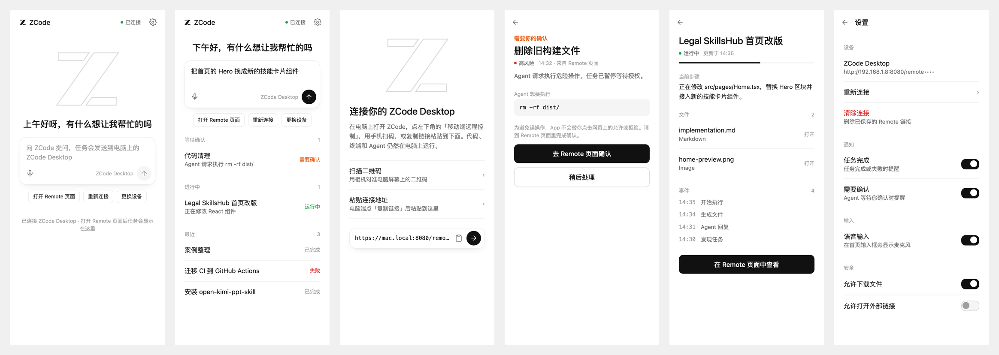

<h1 align="center">ZCode Mobile</h1>

<p align="center">ZCode Desktop 的非官方 Android 远程控制客户端。</p>

<p align="center">
  <a href="./README.en.md">English</a> | <a href="./README.md">简体中文</a>
</p>

<p align="center">
  
  
  
  
</p>

手机只是控制面板。代码、终端、Git、MCP、Skills 和 Agent 都还在电脑上的 ZCode Desktop 里跑，手机通过 ZCode 自带的「移动端远程控制」页面看进度、发任务、收通知。

```text
Android 手机                         电脑
┌──────────────────────┐            ┌──────────────────────┐
│ ZCode Mobile         │  Remote URL │ ZCode Desktop        │
│  · 扫码 / 粘贴链接    │───────────▶│  · 移动端远程控制页面 │
│  · 内嵌官方 Remote 页 │◀───────────│  · Agent / 终端 / Git │
│  · 任务列表 & 通知    │  页面状态   │  · MCP / Skills      │
└──────────────────────┘            └──────────────────────┘
```

不逆向、不伪造私有协议：App 内嵌的就是官方 Remote 页面，任务和确认请求是从页面**可见内容**里识别出来的。识别不到时页面照常可用，原生列表只是留空。

## 界面

<p align="center">
  
</p>

设计跟随 ZCode 桌面端：白底、系统字体、没有卡片的纯列表、一个输入框、黑色圆形发送按钮，橙色只在「需要你确认」时出现。深色模式跟随系统。

> 上图是按 Compose 实现绘制的设计稿，不是真机截图。

## 功能

| | |
|---|---|
| **连接** | 扫描电脑端二维码，或粘贴「复制链接」得到的地址。链接用 Android Keystore 的 AES-GCM 密钥加密保存。 |
| **首页输入框** | 像桌面端一样直接打字，内容会填进 Remote 页面的输入框；也可以用语音。 |
| **任务列表** | 从 Remote 页面识别任务，按「等待确认 / 进行中 / 最近」分组。 |
| **通知** | 任务完成、失败、Agent 等待确认时推送系统通知（前台运行时）。 |
| **确认请求** | 显示 Agent 想执行的命令和启发式风险等级。App **不会**替你点击允许/拒绝，只把你带到 Remote 页面。 |
| **产物预览** | Markdown、HTML、图片、PDF、代码、JSON。 |
| **系统分享** | 从其他 App 把报错信息、文本分享进来直接发给 Agent。 |

### 已知限制

- **仅前台**：Android 会在后台暂停 WebView 的 JavaScript。没有常驻服务、没有 wake lock，不承诺后台实时监控。
- **选择器是启发式的**：`app/src/main/assets/zcode-selectors.json` 里的 DOM 选择器基于公开文档编写，尚未对真实 Remote 页面校验；`app/src/test/resources/fixtures` 是手写的替身。
- **确认是只读的**：出于安全考虑，允许/拒绝必须在 Remote 页面里点。

## 安装

最低 Android 8.0（API 26）。

1. 从 [Releases](https://github.com/245678000000/ZCode-Mobile/releases) 下载 `zcode-mobile-*-release.apk`，或本地编译。
2. 手机上允许安装未知来源应用，安装即可。

## 使用

1. 电脑上打开 ZCode Desktop，点左下角 **移动端远程控制**。
2. 手机上打开 ZCode Mobile，**扫描二维码**，或点电脑端 **复制链接** 后在手机上 **粘贴连接地址**。
   - `https://` 任意主机都接受；`http://` 只接受局域网、回环、`.local`、link-local 和 CGNAT（Tailscale）地址，因为链接路径里带会话密钥。
3. 连接后回到首页，直接输入任务发送，或点 **打开 Remote 页面** 使用完整界面。
4. Android 13+ 第一次进首页会申请通知权限；在设置里打开通知开关时也会申请。

## 编译

需要 JDK 17、Android SDK（Platform 36 + Build Tools 36），`local.properties` 里写好 `sdk.dir`。

```bash
export JAVA_HOME="/opt/homebrew/opt/openjdk@17/libexec/openjdk.jdk/Contents/Home"   # macOS Homebrew 示例
./gradlew assembleDebug
./gradlew testDebugUnitTest lintDebug
./gradlew assembleRelease
```

Release 签名按以下顺序查找：

1. 环境变量 `RELEASE_STORE_FILE` / `RELEASE_STORE_PASSWORD` / `RELEASE_KEY_ALIAS` / `RELEASE_KEY_PASSWORD`（CI 用）
2. 仓库根目录的 `keystore.properties`（已 git-ignore）：
   ```properties
   storeFile=app/keystore/your-release.jks
   storePassword=…
   keyAlias=…
   keyPassword=…
   ```
3. 都没有则用 debug keystore 并给出警告——这种包能装，但换台机器编译的包无法覆盖升级。

### GitHub Actions 发布

`.github/workflows/release.yml` 在推送 `v*` tag 时构建并上传 APK 到 GitHub Release。为了让每个 Release 都用同一把密钥签名（用户才能原地升级），没有配置密钥时工作流会直接失败。需要在仓库 Secrets 里配置一次：

| Secret | 值 |
|---|---|
| `RELEASE_KEYSTORE_BASE64` | `base64 -i app/keystore/your-release.jks` |
| `RELEASE_STORE_PASSWORD` | keystore 密码 |
| `RELEASE_KEY_ALIAS` | 密钥别名 |
| `RELEASE_KEY_PASSWORD` | 密钥密码 |

## 安全

- Remote 链接用 AES-GCM 加密，密钥在 Android Keystore 里，不落明文。
- 界面上的路径令牌打码；日志不打印 token、cookie、Authorization、session id。Release 只输出脱敏后的错误日志。
- HTTPS 页面禁止混合内容；第三方 Cookie 关闭；`file://` 与 content 访问关闭。
- 公网 `http://` 链接直接拒绝。

## 目录

```text
app/src/main/java/app/zcode/mobile/
├── remote/        WebView、JS 桥、DOM 观察器、事件解析与去重
├── model/         Task / Approval / Artifact / 事件模型
├── notification/  通知
├── security/      Keystore 加密存储
├── ui/            Compose 界面（theme / components / 各页面）
└── util/          URL 校验、日志脱敏
app/src/main/assets/
├── zcode-observer.js       注入 Remote 页面的 MutationObserver
└── zcode-selectors.json    DOM 选择器配置
```

## 路线

- 拿真实 Remote 页面 DOM 校验并收紧选择器
- 若 ZCode 发布官方 API / SDK，改为原生通信
- 多设备配置切换
- 生物识别解锁已保存的连接

## 免责声明

非官方社区项目。ZCode 及相关商标归其所有者所有，本项目与 ZCode 官方无隶属或背书关系。

## Star 历史

[](https://star-history.com/#245678000000/ZCode-Mobile&Date)
